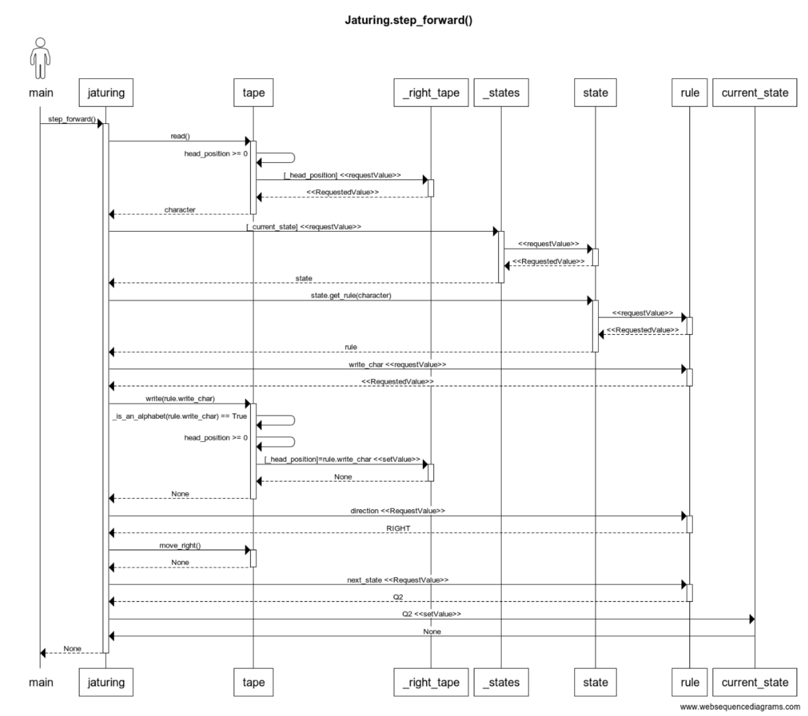

# Jaturing - Turingin kone -simulaattori

# Arkkitehtuuri

## Tiedostot ja niiden sijainti hakemistopuussa

### Dokumentaatio

Dokumentaatio sisältää projektihakemistossa sijaitsevan ```README.md```-tiedoston, sekä ```Dokumentaatio-hakemistossa``` sijaitsevat dokumentit:

[Työaikakirjaus](https://github.com/jatufin/ot-harjoitustyo/blob/master/dokumentaatio/tuntikirjanpito.md)

[Määrittelydokumentti](https://github.com/jatufin/ot-harjoitustyo/blob/master/dokumentaatio/vaatimusmaarittely.md)

[Arkkitehtuuri](https://github.com/jatufin/ot-harjoitustyo/blob/master/dokumentaatio/arkkitehtuuri.md)

### Lähdekoodi:
```
src
│   ├── jaturing.py
│   ├── rule.py
│   ├── state.py
│   ├── tape.py
│   ├── tests
│   │   ├── jaturing_test.py
│   │   ├── jaturing_test.py~
│   │   ├── rule_test.py
│   │   ├── state_test.py
│   │   ├── tape_test.py
│   └── ui
│       ├── jaturing_app.py
│       ├── jaturing_frame.py
│       ├── jaturing_GUI.py

```

#### ```src```-hakemisto

Koko sovelluslogiikka on ```Jaturing```-luokan oliossa, joka käyttää apuluokka * ```State```, ```Rule``` ja ```Tape```.

* ```jaturing.py``` - sisältää ohjelman Jaturing-pääluokan
* ```state.py``` - sisältää ohjelman State-luokan, joka kuvaa yhtä automaatin tilaa. State-luokan olioita säilytetään Jaturing-luokan objektissa Pythonin Dictionary-säiliöissä, jossa tilan nimi toimii avaimena.
* ```rule.py``` - Luokka, joka sisältää säännöt. Rule-luokan olioita säilytetään State-luokan olioissa Pythonin Dictionary-säiliöissä, joissa nauhalta luettava merkki toimii sääntöön viittaavana avaimena
* ```tape.py``` - Jaturing-luokka sisältää yhden Tape-luokan olion, joka sisältää Turingin koneeen nauhan

#### ```ui```-hakemisto

Käyttöliittymä on eritetty kokonaan sovelluslogiikasta.

* ```jaturing_GUI.py``` - Toimii käynnistyspisteenä graafiselle käyttöliittymälle. ```launch()```-metodi saa argumentikseen Jaturing-koneen.
* ```jaturing_app.py``` - Sisältää Tkinterin Tk-luokasta periytetyn JaturingApp -olion, jolle välitetään käytettävä Jaturing-tyyppinen Turingin kone.
* ```jaturing_frame.py``` - Varsinainen käyttöliittymä on toteutettu * ```ttk.Frame```-luokasta peritetyllä * ```JaturingFrame``` -luokalla. Tämä luokka sisältää aliluokkia, joila käyttöliittymän toiminnallisuus on toteutettu.

#### ```tests```-hakemisto

Tämä hakemisto sisältää yksikkötestien lähdekooditiedostot.


## Kaavioita



