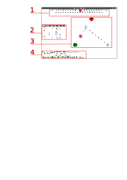

### Käyttö



1. Nauha, jossa korostettuna luku- ja kirjoituspää
2. Käyttäjän muokattavissa olevat tilasiirtymät
3. Graafinen esitys tilasiirtymistä
4. Ohjauspainikkeet

Ikkunan yläreunassa näkyy Turingin koneen nauha. Luku-kirjoituspään sijainti on korostettu punaisella.
Jokaisessa solussa on yksi merkki, (mikäli tekstikenttään syöttää pidemmän merkijonon, vain ensimmäinen merkki huomioidaan). Nauhan päässä olevilla nuolipainikkeilla lukupäätä voi siirtää vasemmalle ja oikealle.

Keskellä vasemmalla on puurakenne, jossa näkyvät koneen tilat, (_states_) ja näihin tiloihin liittyvät säännöt. (_rules_). Tästä napsauttamalla pystyy koneen nykyistä tilaa vaihtamaan.

Keskellä oikealla on NetworkX-kirjastolla toteutettu esitys koneesta graafina, jossa tilat ovat solmuja ja säännöt niiden välisiä kaaria.

Ikkunan alareunassa ilmoitetaan koneen nykyinen tila (_Current state_) ja aloitustila (_Start state). Painikkeella _Set start state to current_ voi koneen asetuksiin vaihtaa aloitustilaksi nykyisen tilan.

Mikäli halutaan siirtyä nauhalla nollan vasemmalla puolella, voidaan tämä tehdä valinnalla _Allow negatie tape incies_.

Painikkeella _Return to start_ kone palautuu alkutilaan ja nauha nollakohtaan.

_Step forward_ suorittaa yhden askeleen koneen sen hetkisellä tilalla ja nauhan sisällöllä ja asemalla.

_Add state_ painikkeella voidaan lisätä tila antamalla sille nimi, mutta määrittämättä sääntöjä.

_Delete state_ ja _Delete rule_ -panikkeilla voidaan poistaa tiloja ja sääntöjä.

_Save file_ -painikkeella voidaan tämän hetkinen Turingin kone tallentaa levylle. Tallennsumuotona on JSON, ja koneen mukana tallentuu nauhan sen hetkinen sisältö ja asema, kaikki tilat ja säännöt, alkutila, sekä tieto ovatko negatiiviset nauhan asemat sallittuja.

_Load file_ painikkeesta päästään lataamaan aikaisemmin tallennettu kone käytettäväksi uudestaan.

#### Säännön ja tilan luominen

Täyttämällä kentät, luodaan uusi sääntö. Mikäli tilaa ei ole olemassa sääntöä luotaessa, se lisätään automaattisesti. Kohdetilan tapauksessa näin ei tapahdu. Koneen nykyinen tila on oletusarvoisesti säännön tila.

* _state_ - Tämä kenttä määrittelee tila, jossa sääntöä sovelletaan
* _Read char_- Mikä merkki pitää lukea nauhalta, jotta sääntöä sovelletaan
* _Write char_ - Mikä merkki nauhalle kirjoitetaan edellisen merkin päälle
* _Move to_ - Mihin suuntaan luku/kirjoituspäätä liikutetaan. Vaihtoehdot ovat vasen (LEFT) ja oikea (RIGHT)
* _New state_ - Mihin tilaan kone siirtyy tämä säännön suorituksen jälkeen.

Jos on määritetty sääntö ```State: q1, read char: a, write char: b, move to: RIGHT, new state: q2```, niin oltaessa tilassa _q1_, niin jos nauhalta luetaan merkki 'a', kirjoitetaan sen tilalle merkki 'b', liikutetaan lukupäätä yksi askel oikealla ja vaihdetaan koneen uudeksi tilaksi _q2_.

#### Esimerkkikoneet

Tällä hetkellä projektihakemistossa on kaksi hyvin yksinkertaista konetta:

* ```Uppercase.json``` - Vaihtaa hyvin rajallisen aakkoston tekstin isoiksi kirjaimiksi
* ```BinaryIncrement.json``` - Kasvattaa binääriluvun arvoa yhdellä
