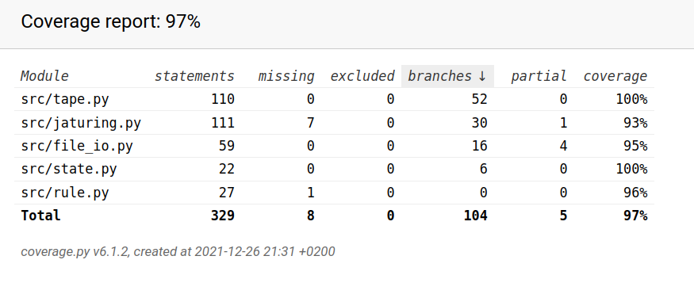

# Testausdokumentti

## Sovelluslogiikka

Pääluokan ```Jaturing``` toiminnallisuus on testattu ```TestJaturing```-testausluokalla. Kukin apuluokka (```Rule```, ```State``` ja ```Tape```) on testattu omassa testiluokassaan.

## Tiedostojenkäsittely

Tallennusmuodot ja tiedostojenkäsittely on eriytetty omaksi ```FileIO```-luokakseen, jonka toiminnallisuus on testattu ```TestFileIO```-luokassa. Tiedostonkäsittelyn testauksessa on toteutettu osittain myös integraatiotestausta, koska tiedostojen tallennus ja lataus ovat riippuvaisia pääluokan toiminnasta.

## Testauskattavuus

Yksikkötestauksen kattavuus on 97%:



Käyttöliittymä on jätetty yksikkötestauksen ulkopuolelle.

## Käyttöliittymä ja järjestelmätestaus

Käyttöliittymän ja sitä myötä komponenttien yhteistoiminta on testattu manuaalisesti. Ohjelma toimii määrittelydokumentissa ja käyttöohjeessa kuvaillulla tavalla.

### Asennus

Ohjelman asennus ja toiminta zip-muotoisesta releasesta on testattu.
