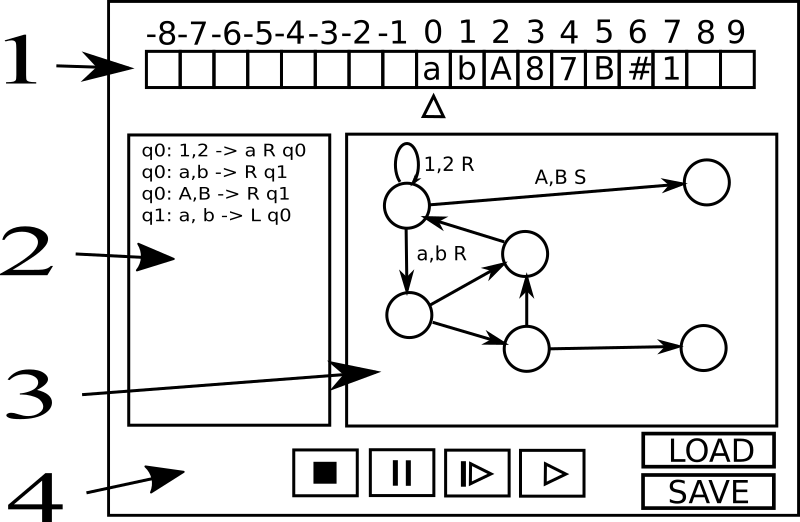

# Vaatimusmäärittely

## Sovelluksen nimi

Sovelluksen nimi on *Jaturing*, joka tulee englanninkielisistä sanoista **Just Another Turing machine**. Yhtäläisyydet tekijän oman nimen alkukirjaimiin ovat täysin tahattomia.

## Sovelluksen tarkoitus

Sovellus toimii opiskelun apuna simuloimalla Turingin koneen toimintaa. Käyttäjä voi itse luoda haluamansa mallin, ja seurata sen toimintaa askel kerrallaan.

## Käyttäjät
Kyseessä on yhden käyttäjän työpöytäsovellus, jonka voi asentaa ja suorittaa tavallisen käyttäjän oikeuksilla, jos tietokoneella on Python 3 asennettuna.

## Käyttöliittymä

### Graafinen käyttöliittymä

Graafinen käyttöliittymä koostuu pääikkunasta, ja erikseen avattavasta asetusikkunasta. Toteutus tehdään Pythonin omalla TkInter-kirjastolla, mutta tilasiirtymäkaavion esityksessä voidaan käyttää kolmannen osapuolen graafi-kirjastoja.



1. Nauha, jonka alapuolella luku- ja kirjoituspää
2. Käyttäjän muokattavissa olevat tilasiirtymät
3. Graafinen esitys tilasiirtymistä
4. Ohjauspainikkeet

### Komentorivikäyttöliittymä

```$ python3 jaturing machinefile.tur [inputstring | -i inputfile.tape] [--verbose | -v]```

Komento suorittaa annetun ```machinefile.tur``` Turingin koneen. Nauhan alkutilana toimii joko ```inputsring```-argumentti, tai ```inputfile```-tiedoston sisältö.

Valinnalla ```--verbose``` tulostetaan riveittän jokainen tilasiirtymä, muussa tapauksessa ainoastaan nauhan tila koneen pysähtyessä tulostetaan.

Tilan tulostus on muodossa ```m: s1s2s3>s4...sN (D s Q)```, jossa:
* ```m``` on juokseva luku
* ```sn``` tarkoittaa arvoa nauhan solussa ```n```
* ```>``` näyttää lukupään sijaintia sen hetkisen kohdan vasemmalla puolella, 
* ```D``` on viimeksi tehty siirron suunta: ```L=left, R=right, S=stay"```
* ```s``` on viimeksi nauhalle kirjoitettu arvo
* ```Q``` on tila (solmu) johon viimeksi siirryttiin

## Perusversion toiminnallisuus

Perusversio tarjoaa yksinauhaisen Turing-koneen simulaattorin, joka konfiguroidaan tekstimuotoisesti.
* Aakkosto sisältää merkit ```[0-9][a-z][A-Z][#]```
* Nauha-aakkosto sisältää lisäksi tyhjä-merkin, jonka esitysmuotona tulostettaessa on piste: ```.```

### Asetukset
Asetuksista voidaan valita:
* päättyykö suoritus, mikäli nauhan aloituspisteestä yritetään siirtyä vasemmalle
* Onko käytössä ```S=stay```-operaatio, vai onko lukupäätä pakko liikuttaa

### Lataus ja tallennus
* Voidaan tallentaa ja myöhemmin uudelleen ladata luotu Turingin-kone tiedostoon. Tiedostopäätteenä on ```tur```, ja tiedostomuoto UTF-8 -koodattu tekstitiedosto, jonka käsin muokkaaminen on mahdollista
* Voidaan tallentaa ja myöhemmin uudelleen ladata nauhan tila tiedostoon. Tiedostopäätteenä on ```tape```, ja tiedostomuoto UTF-8 -koodattu tekstitiedosto, jonka käsin muokkaaminen on mahdollista

## Jatkokehitysideoita

* Turingin koneen muokkaaminen suoraan graafiseen kuvaukseen
* Useampinauhainen Turingin kone
* Erilaisia aakkostoja, esimerkiksi mielivaltaisen suuret kokonaisluvut
* Nauhan tai nauhojen tilojen kuvaaminen värikoodauksilla (bittikartta)

