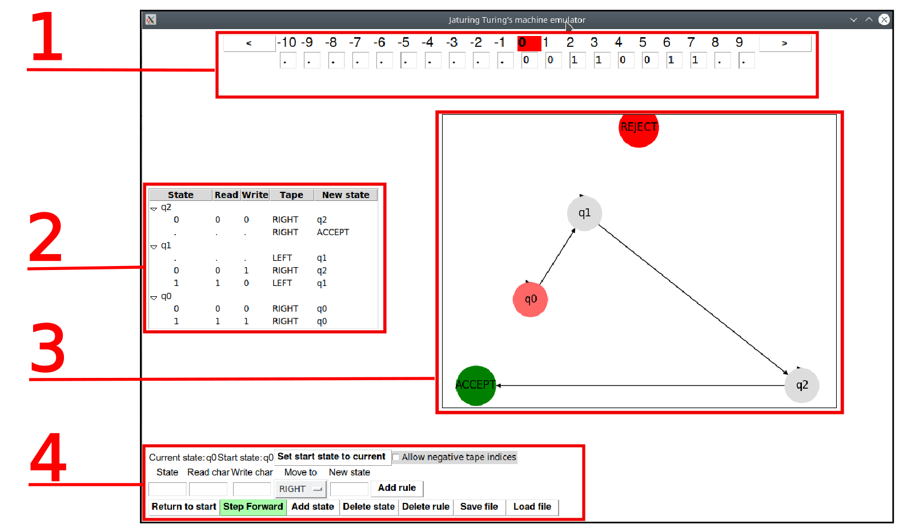

# Vaatimusmäärittely

## Sovelluksen nimi

Sovelluksen nimi on *Jaturing*, joka tulee englanninkielisistä sanoista **Just Another Turing machine**. Yhtäläisyydet tekijän oman nimen alkukirjaimiin ovat täysin tahattomia.

## Sovelluksen tarkoitus

Sovellus toimii opiskelun apuna simuloimalla Turingin koneen toimintaa. Käyttäjä voi itse luoda haluamansa mallin, ja seurata sen toimintaa askel kerrallaan.

## Käyttäjät
Kyseessä on yhden käyttäjän työpöytäsovellus, jonka voi asentaa ja suorittaa tavallisen käyttäjän oikeuksilla, jos tietokoneella on Python 3 asennettuna.

## Käyttöliittymä

Ohjelman graafinen käyttöliittymä avautuu, kun ohjelma käynnistetään. Käynnistys tapahtuu komennolla:

```
$ python3 jaturing.py
```

Graafinen käyttöliittymä koostuu pääikkunasta, ja erikseen avattavasta asetusikkunasta. Toteutus tehdään Pythonin omalla TkInter-kirjastolla, mutta tilasiirtymäkaavion esityksessä voidaan käyttää kolmannen osapuolen graafi-kirjastoja.



1. Nauha, jossa korostettuna luku- ja kirjoituspää
2. Käyttäjän muokattavissa olevat tilasiirtymät
3. Graafinen esitys tilasiirtymistä
4. Ohjauspainikkeet

## Perusversion toiminnallisuus

Perusversio tarjoaa yksinauhaisen Turing-koneen simulaattorin, joka konfiguroidaan tekstimuotoisesti.
* Aakkosto sisältää merkit ```[0-9][a-z][A-Z][#]```
* Nauha-aakkosto sisältää lisäksi tyhjä-merkin, jonka esitysmuotona on piste: ```.```

### Asetukset
Asetuksista voidaan valita:
* Voiko luku-kirjoituspää siirtyä nollakohdan vasemmalle puolelle, eli nauhan negatiivisiin indekseihin.

### Lataus ja tallennus
* Voidaan tallentaa ja myöhemmin uudelleen ladata luotu Turingin-kone sen hetkisine tiloineen tiedostoon. Tiedostopäätteenä on ```json```, ja tiedostomuoto JSON-muotoinen tekstitiedosto, jonka käsin muokkaaminen on mahdollista


## Jatkokehitysideoita

* Turingin koneen muokkaaminen suoraan graafiseen kuvaukseen
* Useampinauhainen Turingin kone
* Erilaisia aakkostoja, esimerkiksi mielivaltaisen suuret kokonaisluvut
* Nauhan tai nauhojen tilojen kuvaaminen värikoodauksilla (bittikartta)

